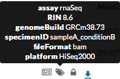
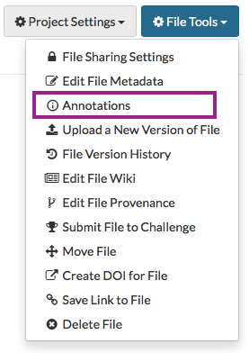

Annotations are key-value pairs stored as metadata for `Projects`, `Files`, `Folders`, and `Tables` that help users to find and query data. Annotations can be based on an existing ontology or controlled vocabulary, or can be created in an *ad hoc* manner and modified later as the metadata evolves. Annotations can be a powerful tool used to systematically group and/or describe things (files or data, etc.) in Synapse, which then provides a way for those things to be searched for and discovered.

 For example, if you have uploaded a collection of alignment files in the BAM file format from an RNA-sequencing experiment, each representing a sample and experimental replicate, you can use annotations to add this information to each file in a structured way. Sometimes, users encode this information in file names, e.g., `sampleA_conditionB.bam`, which makes it "human-readable" but makes it difficult to search for in a systematic way, such as finding all replicates of `sampleA_conditionB`. Adding this information as Synapse annotations enables a more complete description of the contents of the `File`.

 In this case, the annotations you may want to add might look like this:



## Types of Annotations

Annotations can be one of four types:

* Text (Character Limit = 256)
* Integer
* Floating Point
* Date (Date and Time stored as a Timestamp)

## How to Assign Annotations

Annotations may be added when initially uploading a file or at a later date. This can be done using the command line client, the [Python client](https://python-docs.synapse.org/build/html/Views.html#updating-annotations-using-view), the [R client](https://r-docs.synapse.org/articles/views.html#updating-annotations-using-view), or from the web. Using the programmatic clients facilitates batch and automated population of annotations across many files. The web client can be used to bulk update many files using [file views](views.md).

### Adding Annotations

To add annotations on a single entity through the web client, click the `Annotations` button in the upper right corner on a Project, Folder, or File page.



To add annotations on multiple files, please refer to our Synapse in Practice article [Managing Custom Metadata at Scale](managing_custom_metadata_at_scale.md) for a tutorial on how to do this efficiently and effectively leveraging [file views](views.md).

##### Command line

```bash
synapse store sampleA_conditionB.bam --parentId syn00123 --annotations '{"fileFormat":"bam", "assay":"rnaSeq"}'
```

##### Python

```python
entity = File(path="sampleA_conditionB.bam",parent="syn00123")
entity.annotations = {"fileFormat":"bam", "assay":"rnaSeq"}
syn.store(entity)
```

##### R

```r
entity <- File("sampleA_conditionB.bam", parent="syn00123")
entity <- synStore(entity, annotations=list(fileFormat = "bam", assay = "rnaSeq"))
```

### Modifying Annotations

To update annotations on a single file:

Click **File Tools**, **Annotations** and **Edit** to add, delete, or modify annotations. Start by entering a key (the name of the annotation), select the type (text, integer etc.,), and enter the value. Click `Save` to store the annotations for this entity. To enter multiple Values for a single Key click `Enter` with the cursor in the Value field.


To add annotations on multiple files, please refer to our Synapse in Practice article [Managing Custom Metadata at Scale](managing_custom_metadata_at_scale.md) for a tutorial on how to do this efficiently and effectively leveraging [file views](views.md).

##### Command line

```bash
synapse set-annotations --id syn00123 --annotations '{"fileFormat":"bam", "assay":"rnaSeq"}'
```

##### Python

```python
entity = syn.get("syn123")

# Please note that existing annotations will be overwritten. To modify ONLY one annotation:

entity.fileFormat = 'bam'
entity['fileFormat'] = 'bam'

#Please note that existing annotations will be overwritten

entity.annotations = {"fileFormat":"bam", "assay":"rnaSeq"}

syn.store(entity, forceVersion = F)
```

##### R

```r
entity <- synGet("syn00123")

##### Modifying a set of annotations, preserving any existing annotations
existing_annots <- synGetAnnotations(entity)
synSetAnnotations(entity, annotations = c(existing_annots, list(fileType = "bam", assay = "rnaSeq")))

##### Add/update annotations, removing any other existing annotations
synSetAnnotations(entity, annotations = list(fileType = "bam", assay = "rnaSeq"))
```

# Queries



Queries in Synapse look SQL-like and you can query any `Table` or `View` with `<synId>`.

```sql
SELECT * FROM <synId> WHERE <expression>
```

The `<expression>` section are the conditions for limiting the search. Below demonstrates some examples of limiting searches.

```sql
SELECT * FROM syn123456 WHERE "fileFormat"='fastq'
```

```sql
SELECT * FROM syn123456 WHERE "RIN"<=6.1
```

Along with annotations added by users, every entity has a number of fields useful for searching. For a complete list, see:

<a href="https://docs.synapse.org/rest/org/sagebionetworks/repo/web/controller/TableExamples.html" target="_blank" class="btn btn-info btn-lg active" role="button" aria-pressed="true">SQL Query Examples</a>

### Finding Files in a Specific Project

To find all files in a specific `Project`, create a `File View` in the web client. For example, if you'd like to see all files in a `Project`, navigate to your project and then the `Tables` tab. From there, click **Tables Tools** and **Add File View**. Click **Add container** and **Enter Synapse Id** to create a tabluar file view that contains every file in the project, which you can now query. Importantly, if you want to later query on annotations, you must select **Add All Annotations**. For a more in-depth look at this feature, please read our articles on [File Views](views.md).

### Listing Files in a Specific Folder

To list the `Files` in a specific `Folder`, you need to know the synID of the `Folder` (for example syn1524884, which has data from TCGA related to melanoma). All entities in this `Folder` will have a `parentId` of syn1524884.

The function to find all `Files` in this `Folder` is called "getChildren":

##### Python

```python
foo = list(syn.getChildren(parent='syn1524884', includeTypes=['file']))
```

##### R

```r
foo <- as.list(synGetChildren(parent='syn1524884', includeTypes=list('file')))
```

### Queries on Annotations

If annotations have been added to `Files`, they can be used to discover files of interest from `File View` syn123456.
For example, you can identify all `Files` annotated as `bam` files (`fileFormat = bam`) with the following query:

```sql
SELECT * FROM syn123456 WHERE "fileFormat"='bam'
```

Likewise, if you had put the RNA-Seq related files described in the section above into the project syn00123 with the described annotations, then you could find all of the files for `conditionB` and `sampleA`:

```sql
SELECT * FROM syn123456 WHERE "projectId"='syn00123' AND "specimenID"='sampleA_conditionB'
```

Lastly, you can query on a subset of entities that have a specific annotation. You can limit the annotations you want displayed as following.

```sql
SELECT specimenID,genomeBuild,fileFormat,platform FROM file WHERE "projectId"='syn00123' AND "specimenID"='sampleA_conditionB'
```

Reproducible queries can be constructed using one of the analytical clients (command line, Python, and R) and on the web client, query results can be displayed in a table on a wiki page.

In a project, from the wiki page click `Wiki Tools` in the upper right corner to `Edit Project Wiki`. Click `Insert` and choose `Table: Query on Files/Folders`.
Enter your query in the box and click the **Insert** button. Once you save the wiki page, the results will be displayed as a table.

##### Command line

```bash
synapse query "SELECT specimenID,genomeBuild,fileFormat,platform FROM syn123456 WHERE \"specimenID\"='sampleA_conditionB'"
```

```python
result = syn.tableQuery("SELECT specimenID,genomeBuild,fileFormat,platform FROM syn123456 WHERE \"specimenID\"='sampleA_conditionB'")
```

```r
result = synTableQuery("SELECT specimenID,genomeBuild,fileFormat,platform FROM syn123456 WHERE \"specimenID\"='sampleA_conditionB'")
```

### How to Download Based on Queries

You can download files in a folder using queries. Currently this feature is only available in the command line client. For example, if you want to download all files in a File View that has a synapse id of `syn00123`, use

```sql
synapse get -q "SELECT * FROM file WHERE parentId = 'syn00123'"
```

## Troubleshooting

Single quotes in Synapse queries must be replaced by double quotes or two single quotes. In order to query for the `chemicalStructure` of `4'-chemical`:

```sql
SELECT * FROM syn123 where "chemicalStructure" = '4"-chemical'
# OR
SELECT * FROM syn123 where "chemicalStructure" = '4''-chemical'
```

# See Also

[Downloading Data](downloading_data.md), [Tables](tables.md)
